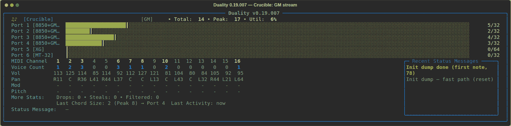

# Duality

**Intelligent Multi-Device MIDI Polyphony Router**

Current development line: **v0.10.11** (see `python duality.py --version`).

Duality routes MIDI notes across two or more sound modules / synthesizers to maximize effective polyphony, while keeping non-note messages synchronized across all devices.

It is designed for musicians and retro-computing enthusiasts who want to combine multiple hardware (and soft) MIDI modules and treat them as one higher-polyphony, format-aware instrument.

<!-- PLACEHOLDER: hero screenshot / short GIF of the live status panel (current UI) -->
<!--  -->

**Screenshots below are from earlier development builds** (layout and feature set have moved on; replacements welcome).


---

## Features

### Polyphony routing
- Load-balancing by **utilization** (fair with mixed `--poly` limits) or pure **round-robin**
- Chord preference (notes arriving close together stay on the same device when possible)
- Smart voice stealing (lowest velocity first, then oldest)
- Independent polyphony limit per device
- Full panic / All Notes Off handling

### Crucible (format-aware routing)
- Optional **output** format tags (what each device can accept), including multi-capability tags (`gs+gm2`, `xg+gm2`, …)
- **Input / stream format** (what the MIDI feed is): from strong SysEx, `--input-format`, or hotkeys — *not* the same as output tags
- **Affinity** routing: notes and SysEx go to outputs compatible with the current **input** format
- Unknown input format → GM-family ports only (**pure MT-32 excluded** until input format is MT-32)
- No silent “send to all” when no port matches the current input format
- Input `GM` → ports tagged `gm` / `gm2`; optional `--crucible-gm-wide` also reaches `gs` / `xg`
- **Set** input format (G/R/Y/M) vs **lock** input format (L): lock blocks SysEx override and idle clear
- SCPOP / SC-ext detection (Roland model 45 or banner) + optional `--scpop`

### Sync delay
- Per-port `--sync-delay` in milliseconds (align hardware vs softsynth latency)
- Relative **negative** offsets supported (normalized so the earliest port is 0)
- Clamped to ±500 ms; **all zeros = zero-cost fast path** (no queue)

### Live status panel
- Per-port meters + peak hold, Total / Peak / Util
- Channel activity, Volume / Pan / Mod / Pitch
- Drops, Steals, Filtered counters
- Rolling recent-status history
- Format badge (optional lock star `*`), activity pulse, mode badges
- Human-readable SysEx (GS / XG / MT-32 effects, resets, display text, …)

### Other
- Redundant controller filtering (sync without excess traffic)
- Arbitrary number of output ports (default 2; 1 allowed with `--alchemy`)
- **Alchemy** (**BROKEN/EXPERIMENTAL**): attempted GS↔XG SysEx/PC rewrite; allows a single output. Do not rely on conversion quality yet.
- Graceful handling of dropped/lost **output** ports with automatic reconnect by name
- Optional **`--log` / `--log-verbose`**: status, Alchemy, bank/PC, and **port health** (open/close/send fail/reconnect)
- Cross-platform (Windows, macOS, Linux)

---

## Requirements

- Python 3.8+
- [mido](https://mido.readthedocs.io/) + [python-rtmidi](https://pypi.org/project/python-rtmidi/)
- [rich](https://rich.readthedocs.io/)

No extra packages are required for Crucible, SCPOP, or `--sync-delay`.

#### Install dependencies

```bash
pip install -r requirements.txt
```

or:

```bash
pip install mido[ports] python-rtmidi rich
```

---

## Usage

### List available MIDI ports
```bash
python duality.py --list
```

### Basic usage (two devices)
```bash
python duality.py --input "loopMIDI Port" --outs "MS40 A" "MS40 B"
```

### Mixed polyphony limits
```bash
python duality.py \
  --input "loopMIDI Port" \
  --outs "Module A" "Module B" "Module C" \
  --poly 28 32 24
```

### Crucible + multi-capability tags
```bash
python duality.py --input "loopMIDI Port" --crucible --crucible-gm-wide \
  --outs \
    "Roland SC-8850 PART A:gs+gm2" \
    "Roland SC-8850 PART B:gs+gm2" \
    "Roland SC-8850 PART C:gm+gm2" \
    "yxg50:xg+gm2" \
    "MUNT:mt32"
```

On Windows, quote each `Name:tag` argument so the shell does not split on `:`.

### Sync delay (e.g. softsynth leads hardware by ~80 ms)
```bash
python duality.py --input "loopMIDI Port" --crucible \
  --outs "SC PART A:gs+mt32" "MUNT:mt32" \
  --sync-delay 0 -80
```
Negatives are relative: the most-negative port becomes 0 ms; others shift later.

### SCPOP (pipe-organ SC files with no model-45 SysEx on the wire)
```bash
python duality.py --input "loopMIDI Port" --scpop --crucible \
  --outs "SC A:gs" "SC B:gs"
```

### Silent mode / version
```bash
python duality.py --input "..." --outs "A" "B" --chord-ms 25 --no-status
python duality.py --version
```

### Interactive mode
If you omit `--outs`, Duality asks you to choose ports (2 by default; 1 with `--alchemy`).

---

## Command-line options

| Option | Description |
|--------|-------------|
| `--input` | MIDI input port name (or partial match) |
| `--outs` | Output ports: `Name` or `Name:tag` or `Name:tag+tag` (`gs`, `xg`, `gm`, `gm2`, `mt32`) |
| `--poly` | Polyphony limit(s): one value for all, or one per port |
| `--sync-delay` | Per-port delay in ms (one or per port). Negatives = relative. ±500 max. Default 0 |
| `--mode` | `balance` (default, utilization-based) or `rr` (round-robin) |
| `--chord-ms` | Chord detection window in ms (default 30) |
| `--crucible` | Enable format-aware routing |
| `--crucible-notes` | `affinity` (default) or `all` |
| `--crucible-gm-wide` | GM/GM2 streams also match `gs` and `xg` ports |
| `--input-format` | Assume `gm` / `gm2` / `gs` / `xg` / `mt32` until SysEx says otherwise |
| `--scpop` | Force SCPOP note broadcast to format-matched ports |
| `--strict-format-detection` | Only actual SYSTEM ON or RESET SysEx messages set/switch input format. (default: any family SysEx) |
| `--alchemy` | Alchemy (**BROKEN/EXPERIMENTAL**): attempt GS↔XG rewrite; allows single output |
| `--alchemy-all` | Alchemy fan-out to all GS/XG-capable outs (implies `--alchemy`) |
| `--log [PATH]` | Append status / Alchemy / bank-PC / port health to a log (default: `duality.log`) |
| `--log-verbose [PATH]` | Verbose log (all CCs, pitch, etc.). Optional path; implies logging. Wins over `--log` if both given |
| `--no-status` | Disable the live status panel |
| `--list` | List MIDI ports and exit |
| `--version` | Show version |
| `-h, --help` | Help |

---

## Hotkeys (while running)

Format keys set the **input / stream format** (how Duality interprets the MIDI feed for Crucible affinity).  
They do **not** change `--outs` tags — those still describe each **output** device’s capabilities.

| Key | Action |
|-----|--------|
| **F** | Clear input format (and unlock) |
| **L** | Lock / unlock current **input** format (blocks SysEx override & idle clear) |
| **G** | Set input format GM; press again for GM2 |
| **R** | Set input format GS |
| **Y** | Set input format XG |
| **M** | Set input format MT-32 |
| **B** | Toggle balance ↔ round-robin |
| **C** | Clear log file (when `--log` / `--log-verbose` is active) |
| **Q** | Panic and quit |
| **Ctrl+C** | Panic and quit |

---

## Status panel

<!-- PLACEHOLDER: current full-panel screenshot -->
<!--  -->

<!-- PLACEHOLDER: short GIF – format badge / Crucible routing in action -->
<!--  -->

While running, Duality can show:

- Per-port activity meters and peak markers  
- Total / Peak voices and utilisation  
- Drops, Steals, Filtered  
- Per-channel voices, Volume, Pan, Mod, Pitch  
- Chord / last activity, status message + rolling history  
- Format badge (`[GS]`, locked `[GS*]`) , Crucible / Alchemy / SCPOP badges  
- Activity pulse and human-readable SysEx lines  

**Older panel capture** (prior UI generation):


Wide terminals (≥ ~118 columns) get the side history panel automatically.

---

## Tips

- Set `--poly` to each module’s **real** available polyphony (multi-voice patches consume more than one).
- Utilization-based **balance** stays fair when limits differ (e.g. 32 vs 96); equal limits are not required.
- Use a virtual loopback (loopMIDI, IAC, etc.) so a DAW/sequencer feeds Duality.
- Prefer **one** `mt32` destination when comparing MT-32 maps; balancing across SC + MUNT splits notes across different latencies.
- Use `--sync-delay` to align a fast softsynth with slower USB hardware; leave at 0 when unused.
- Tag multi-standard modules explicitly (`gs+gm2`) so GM2 set/lock does not “match nothing” and drop notes.
- If a softsynth or hardware port disappears (app quit, player stop), Duality stays up and **retries reconnect** to the same port name. It does **not** re-send banks, programs, or mode resets — re-establish tone maps with your file/player as usual after a device restart.

### Duality looks active but my synth is not responding / I don’t hear anything

WinMM + loopMIDI port ownership is fragile. Try this order:

1. Quit Duality cleanly (**Q** or Ctrl+C).
2. Quit the player (e.g. Windows Media Player) if it was open.
3. Restart the softsynths (or power-cycle hardware) so they re-open their **input** ends of the loopMIDI cables.
4. Start Duality again, then the player.

Preferred cold-start order: **loopMIDI → softsynths → Duality → player**.

With `--log`, check lines prefixed `PORT` (open/close, send failures, reconnects). At session end, each out logs **last successful send** age — useful when the UI is busy but a device stays silent.

---

## Alchemy (BROKEN / EXPERIMENTAL)

`--alchemy` enables the Alchemy path (including a **single** output). Duality may attempt best-effort **GS ↔ XG** SysEx and program/bank rewrites toward tagged outs.

This path is **broken / experimental**: mapping is incomplete, effect translation is unreliable, and results vary by file and device. Same-dialect traffic (e.g. XG → `:xg`) should pass through unchanged. Crucible routing and the rest of Duality work independently of conversion quality.

`--alchemy-all` fans out to all GS/XG-capable outs (implies `--alchemy`).

---

## Licensing

This software is free for personal, educational, research, and other non-commercial use.

Commercial use requires a separate license from the copyright holder.

Copyright © 2026 MIDIMan369. All rights reserved.

See [LICENSE](LICENSE) for full terms.
