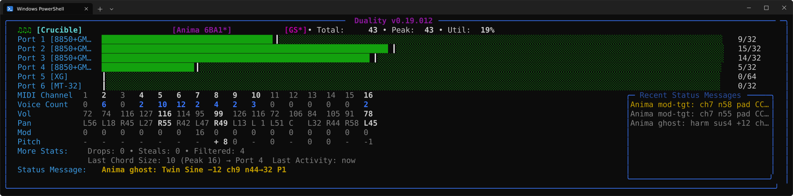
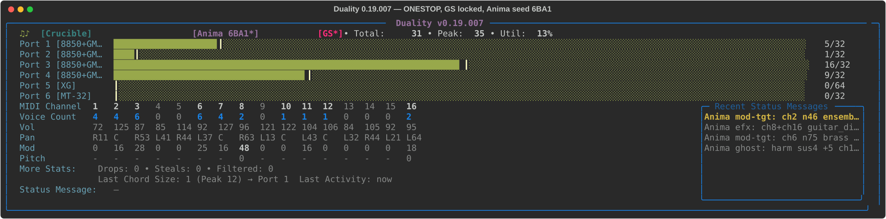
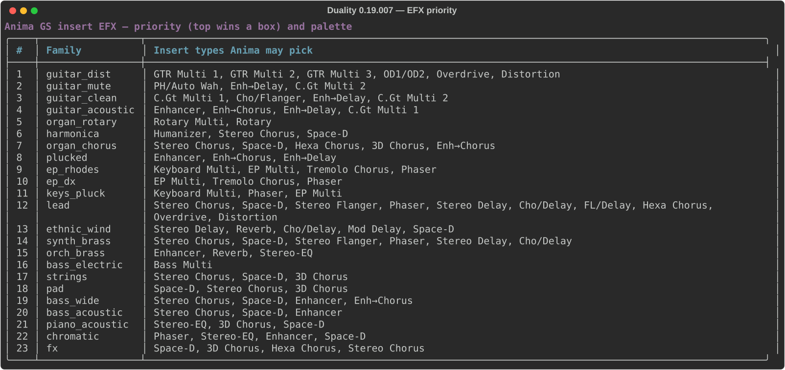
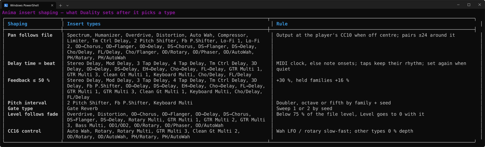
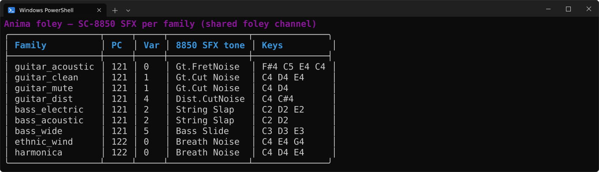

# Duality

**Intelligent Multi-Device MIDI Polyphony Router**

Current development line: **v0.19.018** (`python duality.py --version`).

Duality routes MIDI notes across one or more sound modules so you can treat several hardware and soft synths as a single, higher-polyphony instrument. Non-note messages stay synchronized. Optional layers sit on top of that core:

| Layer | What it does |
|-------|----------------|
| **Router** | Load-balance or round-robin notes; chord grouping; voice steal |
| **Crucible** | Send the stream only to outputs tagged for that MIDI dialect |
| **Voodoo** | Super-Munt-style GM on real MT-32 / CM-32 hardware |
| **Anima** | Humanize + GS EFX + foley + 8850 / CM-64 tone colors (GM files on GS hardware) |
| **Alchemy** | Experimental GS↔XG rewrite — **broken; do not rely on it** |

Built for musicians and retro-computing folks (DOS soundtracks, Sound Canvas, XG, MT-32, Ketron/Solton, etc.).



*Live panel from an offline replay of a real GM soundtrack with the input locked to GS (**R** then **L**, badge `[GS*]`): four Sound Canvas VA units take the notes, the XG and MT-32 outs stay idle; Crucible + Anima, seed 6BA1, rock section with both guitars on OD1/OD2.*

---

## Features

### Polyphony routing
- Load-balancing by **utilization** (fair with mixed `--poly` limits) or pure **round-robin**
- Chord preference (notes arriving close together stay on the same device when possible)
- Smart voice stealing (lowest velocity first, then oldest)
- Independent polyphony limit per device
- Full panic / All Notes Off; **X** sends dialect resets to tagged outs and clears Anima locks

### Crucible (format-aware routing)
- Optional **output** tags: what each device can accept (`gs`, `xg`, `gm`, `gm2`, `mt32`, plus `gs+gm2`, …)
- **Input / stream format** (what the feed *is*): SysEx detect, `--input-format`, or hotkeys — not the same as output tags
- Affinity: notes and SysEx go to compatible ports
- Unknown input → GM-family ports only (**pure MT-32 excluded** until the stream is MT-32)
- No silent “send to all” when nothing matches
- `GM` → `gm` / `gm2`; `--crucible-gm-wide` also reaches `gs` / `xg`
- **Set** format (G/R/Y/M) vs **lock** (L): lock blocks SysEx override and idle clear
- `--strict-format-detection`: only System On / Reset SysEx may switch format
- SCPOP / SC-ext (model-45 or banner — not LCD animation text) + optional `--scpop`


*Same notes, four input dialects, same outs (four `8850+gm2`, one `xg`, one `mt32`). GM and GS land on the 8850 outs, XG only on the XG out, MT-32 only on the MT-32 out. Stills: [GM](docs/images/crucible-gm.svg) · [GS](docs/images/crucible-gs.svg) · [XG](docs/images/crucible-xg.svg) · [MT-32](docs/images/crucible-mt32.svg).*

### Voodoo (MT-32 GM)
- Roland **MT-TO-GM** (1993) or Sierra **KQ6** bank on `:mt32` / `:mt` / `:cm` outs
- Paced SysEx + input queue with elastic catch-up (does not dump the buffer)
- 1 / 2 / 3 unit maps; 4+ even units can use **pairs** (hotkey **P**)
- LA32 pan table (8 real positions, center split L1 / C)
- Auto when every out is MT-32 and the stream is not; exit on real MT-32 SysEx
- `--voodoo` at launch seeds MT-32 format so you can **L**ock it

### Anima (opt-in phrasing)
- Velocity humanize, expression / mod ramps, guitar strum (including “Hetfield” down-pick on dirt tones)
- **GS EFX**: one insertion per `:gs` unit, chosen by instrument-family priority; never retyped under a sounding part; guitars pair via OD1/OD2 by pan; file-driven EFX stays on its port
- **Insert shaping**: each family picks from hand-chosen palettes of the 64 SC-8850 / SC-88Pro types; pan-capable inserts follow the file's pan, delays lock to the beat (feedback ≤ 50 %), pitch shifters play a doubler / octave / fifth, and dirt inserts fade out with the file
- **Ghosts**: chord-tone harmony, bass / organ sub-octaves, dirt-guitar unison on a spare unit
- **Foley**: shared high channel (usually 16) for 8850 SFX (fret, cut, chord stroke, slap, breath, …)
- **Tone colors**: seeded 8850 CC00 (same PC) plus family-matched **CM-64 PCM/LA** (banks 126/127, SC-55 map)
- File **GM/GM2 On** on `:gs` ports becomes **GS Reset** so the Canvas leaves GM-lock and honors those banks
- 4-char hex **seed** on the badge; `--anima-seed` / **S** lock a keeper across **X**
- Game mode (`--anima-game` / **A** cycle): 4 s of real silence resets; a real PC burst (new cue) rolls a new seed
- Single output allowed when Anima is on

### Record + log
- `--record [DIR]` / hotkey **W**: IN + each OUT as type-1 SMF (conductor + Ch1–Ch16 + SysEx), in `recordings/` by default
- Idle ~10 s closes a take and the next MIDI opens a new file
- `--log` / `--log-verbose`: `logs/duality-<date>-<time>.log`, one per run and, with `--record`, one per take (same stamp as its IN/OUT files); **C** starts a new log

### Live status panel
- Per-port meters + VU-style peak hold, Total / Peak / Util
- MIDI Channel / Voice Count / Vol / Pan / Mod / Pitch
- Drops, Steals, Filtered; activity pulse
- Rolling “Recent” history; format badge (`[GS]`, locked `[GS*]`)
- Human-readable GS / XG / MT-32 SysEx (resets, EFX, display text, …)

### Other
- Redundant CC filtering (devices stay in sync with less traffic)
- Per-port `--sync-delay` (negatives relative; all zeros = no queue)
- Dropped output ports: stay up and reconnect by name (does **not** re-program the synth)
- **Developed and tested on Windows.** MIDI I/O is portable via python-rtmidi (WinMM / CoreMIDI / ALSA). Mac and Linux should run; they are not part of the regular test pass. Please file issues if you try them.

---

## Requirements

- Python 3.8+
- [mido](https://mido.readthedocs.io/) + [python-rtmidi](https://pypi.org/project/python-rtmidi/)
- [rich](https://rich.readthedocs.io/)

```bash
pip install -r requirements.txt
```

or:

```bash
pip install mido[ports] python-rtmidi rich
```

Repo layout (runtime):

| File | Role |
|------|------|
| `duality.py` | Router, UI, Crucible, Anima, Voodoo, record |
| `tables_gs.py` | GS EFX types (all 64, SC-8850 / 88Pro), macros, Anima palettes + insert shaping |
| `tables_xg.py` | XG types + Alchemy maps |
| `tables_anima.py` | GM / MT-32 / Sierra categories |
| `tables_8850.py` | SC-8850 CC00 + map + CM-64 variation tables |
| `tables_voices.py` | SC-8850 voices per tone (poly accounting) |
| `tables_voodoo.py` / `voodoo_banks.py` | MT-TO-GM / KQ6 SysEx |

### Platforms

| | Windows | macOS | Linux |
|--|---------|-------|-------|
| Tested by the author | Yes | No | No |
| MIDI backend | WinMM | CoreMIDI | ALSA |
| Typical loopback | loopMIDI | IAC Driver | `snd-virmidi` / JACK |
| Hotkeys | `msvcrt` | cbreak stdin | cbreak stdin |

Unix hotkeys need a real TTY. Ctrl+C always panics.

---

## Usage

### List ports
```bash
python duality.py --list
```

### Two devices (classic)
```bash
python duality.py --input "loopMIDI Port" --outs "MS40 A" "MS40 B"
```

### Mixed polyphony
```bash
python duality.py \
  --input "loopMIDI Port" \
  --outs "Module A" "Module B" "Module C" \
  --poly 28 32 24
```

### Crucible + multi-capability tags
```bash
python duality.py --input "loopMIDI Port" --crucible --crucible-gm-wide \
  --outs \
    "Roland SC-8850 PART A:gs+gm2" \
    "Roland SC-8850 PART B:gs+gm2" \
    "Roland SC-8850 PART C:gm+gm2" \
    "yxg50:xg+gm2" \
    "MUNT:mt32"
```

On Windows, quote each `Name:tag` so the shell does not split on `:`.

### Four GS ports + Anima (GM soundtrack on Canvas hardware)
```bash
python duality.py --input duality \
  --outs "SCVA:gs+gm2" "SCVA2:gs+gm2" "SCVA3:gs+gm2" "SCVA4:gs+gm2" \
  --poly 32 32 32 32 --crucible --crucible-gm-wide --anima-game --log --record
```

### Voodoo on two MT-32s (hardware GM)
```bash
python duality.py --input duality \
  --outs "MIDIMate 1:mt32" "MIDIMate 2:mt32" \
  --voodoo --voodoo-bank mtgm --sync-delay 0 80
```

### Sync delay (softsynth ~80 ms ahead of hardware)
```bash
python duality.py --input "loopMIDI Port" --crucible \
  --outs "SC PART A:gs+mt32" "MUNT:mt32" \
  --sync-delay 0 -80
```

Negatives are relative: the most-negative port becomes 0 ms; others shift later.

### SCPOP without model-45 SysEx
```bash
python duality.py --input "loopMIDI Port" --scpop --crucible \
  --outs "SC A:gs" "SC B:gs"
```

### Silent / version
```bash
python duality.py --input "..." --outs "A" "B" --chord-ms 25 --no-status
python duality.py --version
```

Omit `--outs` for interactive pick (2 ports by default; 1 allowed with `--alchemy` or `--anima`).

---

## Command-line options

| Option | Description |
|--------|-------------|
| `--input` | MIDI input port (partial name ok) |
| `--outs` | `Name` or `Name:tag` or `Name:tag+tag` (`gs`, `xg`, `gm`, `gm2`, `mt32`, `mt`, `cm`) |
| `--poly` | One limit for all, or one per port |
| `--sync-delay` | Per-port delay in ms. Negatives = relative. ±500 max. `0` = fast path |
| `--mode` | `balance` (default) or `rr` |
| `--chord-ms` | Chord window in ms (default 30) |
| `--crucible` | Format-aware routing |
| `--crucible-notes` | `affinity` (default) or `all` |
| `--crucible-gm-wide` | GM/GM2 also matches `gs` and `xg` |
| `--input-format` | Assume `gm` / `gm2` / `gs` / `xg` / `mt32` until SysEx says otherwise |
| `--strict-format-detection` | Only System On / Reset SysEx may switch format |
| `--scpop` | Force SCPOP note broadcast to format-matched ports |
| `--anima` | Phrasing + GS EFX + foley + 8850 / CM-64 tone colors |
| `--anima-game` | Game mode (implies `--anima`): 4 s silence reset + cue reroll |
| `--anima-seed [HEX]` | Lock seed (`4A2F`, `0x4A2F`, or decimal). Bare flag locks first roll |
| `--anima-efx-stable` | Deprecated alias for bare `--anima-seed` |
| `--voodoo` | Load GM bank on MT-32 outs at start |
| `--voodoo-bank` | `mtgm` (default) or `kq6` |
| `--voodoo-layout` | `stripe` (default) or `pairs` |
| `--alchemy` | **BROKEN/EXPERIMENTAL** GS↔XG rewrite; allows one output |
| `--alchemy-all` | Alchemy fan-out to all GS/XG outs (implies `--alchemy`) |
| `--record [DIR]` | Write IN/OUT SMFs (default dir `recordings/`, created if needed). Hotkey **W** |
| `--log [PATH]` | Status / bank / port health. Default `logs/duality-<stamp>.log` (per run, per take). A path with `{stamp}` does the same; a plain path is appended to |
| `--log-verbose [PATH]` | All CCs etc. Wins if both log flags are set |
| `--no-status` | No live panel |
| `--list` | List ports and exit |
| `--version` | Version |
| `-h, --help` | Help |

---

## Hotkeys

Format keys set the **input / stream format** for Crucible. They do **not** change `--outs` tags.

| Key | Action |
|-----|--------|
| **F** | Clear input format (and unlock) |
| **L** | Lock / unlock input format |
| **G** | Input GM; again → GM2 |
| **R** | Input GS |
| **Y** | Input XG |
| **M** | Input MT-32; again while MT-32 → Voodoo on/off |
| **V** | Cycle Voodoo bank (`mtgm` / `kq6`) |
| **P** | Voodoo layout stripe ↔ pairs (4+ even MT-32 units) |
| **A** | Anima off → normal → game → off |
| **S** | Lock / unlock Anima seed (X keeps colors while locked) |
| **B** | Balance ↔ round-robin |
| **X** | Panic + dialect resets + Anima session reset (not format lock) |
| **W** | Start / stop recording |
| **C** | Start a new log file (a fixed `--log` path is cleared instead) |
| **Q** | Panic and quit |
| **Ctrl+C** | Panic and quit |

---

## Status panel



While running:

- Per-port meters and peak markers
- Total / Peak / Util; Drops, Steals, Filtered
- Per-channel voices, Volume, Pan, Mod, Pitch
- Last chord, last activity, status + rolling history
- Format badge (`[GS]`, `[GS*]`), Crucible / Voodoo / Anima / SCPOP
- Activity pulse and decoded SysEx

Wide terminals (≥ ~118 columns) get the side **Recent** panel automatically.

---

## Anima notes

Anima is off unless `--anima` / `--anima-game` or hotkey **A**. It is the musician between the file and the hardware: touch, colors, and inserts — not a rewrite of the sequence.

**GM files on a Sound Canvas.** A file **GM System On** locks an 8850/SCVA into GM mode, which **ignores** CC00, CC32, and CM-64 banks. With Anima on, Duality turns that message into a **GS Reset** on `:gs` / `:sc` ports (and **XG System On** on `:xg` ports) so variations actually sound. That is why a capital-only GM soundtrack can use the 8850 map and the CM-64 LA organs / horns.

**Tone colors.** If the file leaves bank `0/0` (or lands back on a GM capital), Anima may pick:

- another **8850 CC00** of the **same PC** (map 1–4), or
- a family-matched **CM-64 PCM (126) / LA (127)** tone on the SC-55 map (`CC32=1`).

Family is tracked so a later PC stays in brass / organ / strings / …. A *real* file variation (non-zero CC00 that is not “back to capital”) wins and Anima steps off that part. Live slots are held across a scene `CC0=0` pad so a GM reset dump does not wipe a CM horn back to Bowed Glass.

**Seeds.** The badge shows a 4-char hex. Same seed → same colors. `--anima-seed 4A2F` or hotkey **S** locks it; **X** then repeats the take. Game mode rolls a new seed on a burst of program changes (new cue) unless the seed is locked.

**GS EFX** — each tagged GS unit has one insertion effect, so with four units Anima can give four instrument families an insert at a time. Families are ranked (table below): guitars first, then organ / harmonica / plucked / e-pianos, lead / wind / brass, bass, strings, pad, piano, chromatic, fx.

- **Placement.** The program-change dump at song start is placed once, after it settles (or at the first note), so each unit gets one type write. A part that is actually playing takes a lower-ranked unit in a gap in that owner's playing. A lower part only gets a unit whose owner has gone stale: silent 15 s, or never played within its grace (1 s after the song-start dump, 12 s after a mid-song PC).
- **No glitches under notes.** A unit's insert type (and who owns it) never changes while one of its insert parts is sounding, including ghosts and queued strums. Dry parts on that unit don't count. At most one type change per unit every 1.2 s, and for 150 ms after a change that part's notes play on another unit instead (rerouted, never delayed).
- **Guitars.** A second guitar pairs onto its partner's unit before taking another family's. Hard-left / hard-right pairs use OD1/OD2 so each keeps its side (centered until a quiet moment allows the switch). A panned lone guitar prefers Overdrive / Distortion, which honour its pan.
- **File EFX** stays on the file's port; Anima uses the *other* units.

**Palettes.** Every family has its own list of insert types, drawn from all 64 on the SC-8850 (the SC-88Pro has the same 64, at the same addresses, so both get the Multis). The lists were picked by ear, one tone per family, with each type marked normal, **favoured** (twice as likely) or **less often** (half as likely). The seed picks one per unit; a locked seed repeats it.



**Shaping.** After a type is picked, Duality sets the parameters that make it fit the part:

- **Pan follows the file.** Types with a Pan knob (Humanizer, Auto Wah, Overdrive / Distortion, Compressor, the OD→ / DS→ series, …) put the output where the file panned the player. Parallel pairs (Cho/Delay, OD/Rotary, …) and the two pitch voices sit ±24 either side of it.
- **Delays on the beat.** Delay times come from the tempo: MIDI clock if the player sends it, otherwise the rhythm of the notes. Multi-tap delays keep their tap pattern, and a delay picked before the beat is known is set once the part rests. Feedback is +30 % (+16 % on strings, pads, organs, fx and synth brass) and never above +50 %.
- **Pitch shifters as free harmony.** 2 Pitch Shifter, Fb P.Shifter and Keyboard Multi play a doubler, an octave or a fifth (by family and seed) — harmony that costs no polyphony.
- **Gate Reverb** uses its Sweep 1 / 2 modes.
- **Dirt fades out.** A part's volume sits *before* its insert, so a fade into Overdrive used to stay loud. Dirt inserts now drop their own Level with the file's CC7 / CC11 once it falls below 75 %.
- **CC16** (the insert's control source) only moves wah and rotary types, on EFX Control 1 or 2 — whichever holds the wah or speed knob on that type.



Bass split: Finger / Picked (`bass_electric`) lean on **Bass Multi**; slap, fretless and synth bass (`bass_wide`) and upright (`bass_acoustic`) have their own lists, mostly chorus / Space D / enhancer.

**Ghosts** — extra notes Anima adds on the same channel: a chord-tone harmony on melody lines (never above C7), a sub-octave under bass and organ, and a unison double of a dirt guitar on a spare unit. Harmony is balanced so a section does not just get louder: a melody keeps its velocity and gets its ghost above at 50%; an accompaniment voice (another part sounds above it, or it tops a held chord while a line moves) plays at 85% with its ghost *below* at 45% (a third or sixth under, never below C3); a thin source (at most one other voice) gets both sides, extending the chord. An upper ghost steps aside when a line starts over it, and a pitch another part (or its ghost) already sounds is not doubled. **Featured lines** ("other heroes"): Anima watches every part for a fast, mostly single-note, mostly stepwise line in the middle or top register (at least 2.5 notes/s; arpeggios and ostinatos leap, so they do not qualify). While one plays, its notes are lifted part of the way toward the loudest part sounding over it (never more than ×1.4), other parts starting in its register play at 85% and turn their harmony below it, and no harmony ghost is left on its notes. When two lines qualify, the clearly busier one wins. Each wheel it moves (CC1 mod, CC11 expression) returns to rest on every unit, and a program change starts the new instrument with the mod wheel at zero.

**Foley** — one shared SFX channel per GS synth (usually 16), overflowed to another out if the hero is full. 8850 programming stays on the **default map**. Gesture after a short hold: fret / cut / chord stroke / steel slide; bass slap vs slide; wind click vs breath. Families take turns on the same lane.



**Game mode** — resets after 4 s of real silence (no new MIDI *and* nothing still sounding, so a held chord is not a new scene), and rolls a new seed + EFX set on a real PC burst (DOS / soundtrack cue changes).

---

## Voodoo notes

Think “Super Munt GM,” but on hardware. `--voodoo` or **M** while the input format is already MT-32.

- Init is paced on purpose (MT-32 buffer). Several units in parallel still share the host MIDI interface, so wall-clock time grows with unit count.
- Incoming MIDI is queued during load, then caught up with a speed ceiling — not dumped.
- Real MT-32 SysEx in the stream drops Voodoo and returns to normal MT-32 routing.

---

## Recordings

`--record` or **W** writes into `recordings/` (or the folder you give) — git ignores it, like `logs/`:

- `IN-<input>-<format>-<timestamp>.mid`
- `OUT-<port>-<tags>-<timestamp>.mid` per output

Type-1 SMF: tempo track, **Ch1–Ch16**, plus a SysEx track. Includes Duality’s own bank/PC/EFX/foley, so an OUT file is “what the synth heard.”

---

## Alchemy (BROKEN / EXPERIMENTAL)

`--alchemy` / `--alchemy-all` may rewrite GS↔XG SysEx and some PCs. Mapping is incomplete and effect translation is unreliable. Same-dialect traffic (XG → `:xg`) should pass through. Use Crucible + Anima + Voodoo instead unless you are debugging conversion.

---

## Tips

- Set `--poly` to each module’s **real** voices (multi-osc patches cost more than 1).
- **Balance** stays fair when limits differ (32 vs 96).
- Feed Duality from a loopback (loopMIDI, IAC, ALSA virtual ports).
- Tag multi-standard modules (`gs+gm2`) so a GM2 lock does not match nothing.
- `--sync-delay` for USB vs softsynth skew; leave `0` when unused.
- After a synth restart, Duality reconnects the port but does **not** re-send banks — play a reset or hit **X**.

### Duality looks active but my synth is silent

WinMM + loopMIDI ownership is fragile. Try:

1. Quit Duality (**Q** or Ctrl+C).
2. Quit the player if it was open.
3. Restart softsynths (or power-cycle hardware) so they re-open the **input** side of the cable.
4. Start Duality, then the player.

Cold start: **loopMIDI → softsynths → Duality → player**.

With `--log`, watch `PORT` lines. Session end logs last successful send age per out.

---

## Licensing

This software is free for personal, educational, research, and other non-commercial use.

Commercial use requires a separate license from the copyright holder.

Copyright © 2026 MIDIMan369. All rights reserved.

See [LICENSE](LICENSE) for full terms.
