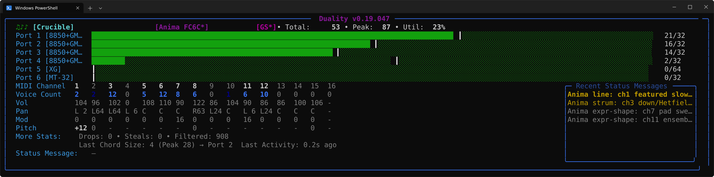
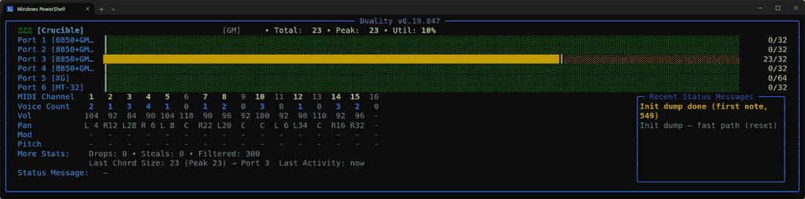
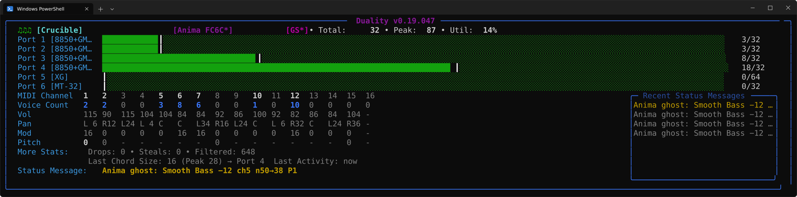
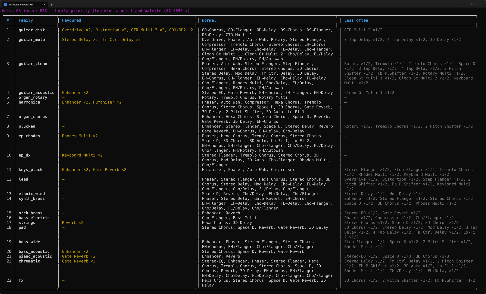
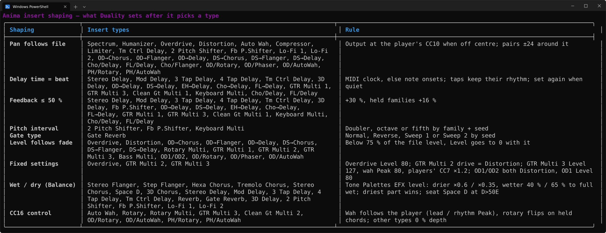
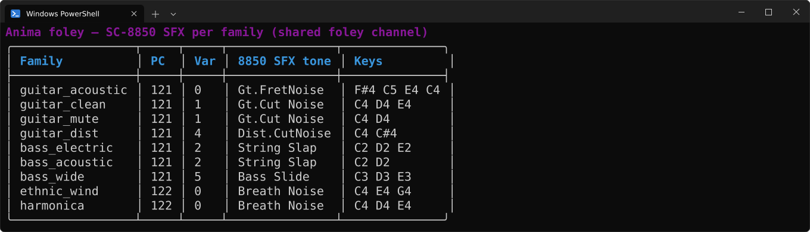

# Duality

**Intelligent Multi-Device MIDI Polyphony Router**

Current development line: **v0.19.047** (`python duality.py --version`).

Duality routes MIDI notes across one or more sound modules so you can treat several hardware and soft synths as a single, higher-polyphony instrument. Non-note messages stay synchronized. Optional layers sit on top of that core:

| Layer | What it does |
|-------|----------------|
| **Router** | Load-balance or round-robin notes; chord grouping; voice steal |
| **Crucible** | Send the stream only to outputs tagged for that MIDI dialect |
| **Voodoo** | Super-Munt-style GM on real MT-32 / CM-32 hardware |
| **Anima** | Humanize + GS EFX + foley + 8850 / CM-64 tone colors (GM files on GS hardware) |
| **Alchemy** | Experimental GS↔XG rewrite — **broken; do not rely on it** |

Built for musicians and retro-computing folks (DOS soundtracks, Sound Canvas, XG, MT-32, Ketron/Solton, etc.).



*Live panel from an offline replay of ONESTOP2 (`tests/make_onestop2.py`) with the input locked to GS (**R** then **L**, badge `[GS*]`): four Sound Canvas VA units take the notes, the XG and MT-32 outs stay idle; Crucible + Anima, seed FC6C, the screaming solo: ch1 on GTR Multi 3 is the featured line, bent up an octave, while the rhythm guitar strums and the pads swell.*

---

## Features

### Polyphony routing
- Load-balancing by **utilization** (fair with mixed `--poly` limits) or pure **round-robin**
- Chord preference (notes arriving close together stay on the same device when possible)
- Smart voice stealing (lowest velocity first, then oldest)
- Independent polyphony limit per device
- Full panic / All Notes Off; **X** sends dialect resets to tagged outs and clears Anima locks

### Crucible (format-aware routing)
- Optional **output** tags: what each device can accept (`gs`, `xg`, `gm`, `gm2`, `mt32`, `cm32`, `cm64`, plus `gs+gm2`, …)
- **Input / stream format** (what the feed *is*): SysEx detect, `--input-format`, or hotkeys — not the same as output tags
- Affinity: notes and SysEx go to compatible ports
- Unknown input → GM-family ports only (**pure MT-32 excluded** until the stream is MT-32)
- An MT-32 stream plays on every LA out (`mt32`, `cm32`, `cm64`); on a CM-64, ch 11–16 go to its PCM half (see [CM-64 notes](#cm-64-notes))
- No silent “send to all” when nothing matches
- `GM` → `gm` / `gm2`; `--crucible-gm-wide` also reaches `gs` / `xg`
- **Set** format (G/R/Y/M) vs **lock** (L): lock blocks SysEx override and idle clear
- `--strict-format-detection`: only System On / Reset SysEx may switch format
- SCPOP / SC-ext (model-45 or banner — not LCD animation text) + optional `--scpop`



*Same notes, four input dialects, same outs (four `8850+gm2`, one `xg`, one `mt32`). GM and GS land on the 8850 outs, XG only on the XG out, MT-32 only on the MT-32 out. Stills: [GM](docs/images/crucible-gm.svg) · [GS](docs/images/crucible-gs.svg) · [XG](docs/images/crucible-xg.svg) · [MT-32](docs/images/crucible-mt32.svg).*

### Voodoo (MT-32 GM)
- Roland **MT-TO-GM** (1993) or Sierra **KQ6** bank on `:mt32` / `:cm32` / `:cm64` outs (`:mt` / `:cm` work too)
- Paced SysEx + input queue with elastic catch-up (does not dump the buffer)
- 1 / 2 / 3 unit maps; 4+ even units can use **pairs** (hotkey **P**)
- LA32 pan table (8 real positions, center split L1 / C)
- Auto when every out is LA (MT-32 / CM-32L / CM-64) and the stream is not; exit on real MT-32 SysEx
- `--voodoo` at launch seeds MT-32 format so you can **L**ock it

### Anima (opt-in phrasing)
- On a mixed rig, Anima's GS layer (inserts, seats, hero split, foley) only uses GS units that can get notes: under Voodoo, or when Crucible sends an MT-32 stream to the LA outs only, the GS units are left alone (0.19.063).
- On LA outs (MT-32 / CM-32L / CM-64): velocity humanizing, CC11 / CC1 swells, strum / unroll, mallet sticking and the lifts work as on GS; EFX, tone palettes, seats, foley and harmony ghosts are GS-only (ghosts are off on native MT-32 / CM music too, 0.19.064). Native MT-32 streams look their LA patches up as the nearest GM program (`tables_anima.MT32_TO_GM`, from the CM-64 manual's sound list) for the GM-numbered sets, so MT-32 organs are no longer played as mallets; a native CM-64 stream's PCM channels (11–16) use the CM-32P tones (`tables_cm64.CM64_PCM_GM`) (0.19.061).
- Velocity humanize, expression / mod ramps, guitar strum (including “Hetfield” down-pick on dirt tones)
- **GS EFX**: one insertion per `:gs` unit, chosen by instrument-family priority; never retyped under a sounding part; guitars pair via OD1/OD2 by pan; file-driven EFX stays on its port
- **Insert shaping**: each family picks from hand-chosen palettes of the 64 SC-8850 / SC-88Pro types (weights set on the published **EFX Palettes** page); pan-capable inserts follow the file's pan, delays lock to the beat (feedback ≤ 50 %), pitch shifters play a doubler / octave / fifth, and dirt inserts fade out with the file
- **Live insert control**: the wah follows the player like a foot on a pedal (lead vs rhythm), rotary speed flips on held chords, and a file's own set-and-left wah gets played too
- **Hero split**: a featured line that shares a unit with its family can take a spare unit with another type of the same family
- **Ghosts**: chord-tone harmony, bass / organ sub-octaves, dirt-guitar unison on a spare unit
- **Foley**: shared high channel (usually 16) for 8850 SFX (fret, cut, chord stroke, slap, breath, …)
- **Tone colors**: seeded 8850 CC00 (same PC), older-map (SC-55 / 88 / 88Pro) and **CM-64** tones that are not copies, weighted per tone on the published **Tone Palettes** page; notes there become traits (no LFO insert on a tone that already moves, no harmony on a tone that plays fifths, one-shots go back to the capital when held, …)
- File **GM/GM2 On** on `:gs` ports becomes **GS Reset** so the Canvas leaves GM-lock and honors those banks
- 4-char hex **seed** on the badge; `--anima-seed` / **S** lock a keeper across **X**
- Game mode (`--anima-game` / **A** cycle): 4 s of real silence resets; a real PC burst (new cue) rolls a new seed
- Single output allowed when Anima is on

### Record + log
- `--record [DIR]` / hotkey **W**: IN + each OUT as type-1 SMF (conductor + Ch1–Ch16 + SysEx), in `recordings/` by default
- Idle ~10 s closes a take and the next MIDI opens a new file
- `--log` / `--log-verbose`: `logs/duality-<date>-<time>.log`, one per run and, with `--record`, one per take (same stamp as its IN/OUT files); **C** starts a new log

### Live status panel
- Per-port meters + VU-style peak hold, Total / Peak / Util
- MIDI Channel / Voice Count / Vol / Pan / Mod / Pitch
- Drops, Steals, Filtered; activity pulse
- Rolling “Recent” history; format badge (`[GS]`, locked `[GS*]`)
- Human-readable GS / XG / MT-32 SysEx (resets, EFX, display text, …)

### Other
- Redundant CC filtering (devices stay in sync with less traffic)
- Per-port `--sync-delay` (negatives relative; all zeros = no queue)
- Dropped output ports: stay up and reconnect by name (does **not** re-program the synth)
- **Developed and tested on Windows.** MIDI I/O is portable via python-rtmidi (WinMM / CoreMIDI / ALSA). Mac and Linux should run; they are not part of the regular test pass. Please file issues if you try them.

---

## Requirements

- Python 3.8+
- [mido](https://mido.readthedocs.io/) + [python-rtmidi](https://pypi.org/project/python-rtmidi/)
- [rich](https://rich.readthedocs.io/)

```bash
pip install -r requirements.txt
```

or:

```bash
pip install mido[ports] python-rtmidi rich
```

Repo layout (runtime):

| File | Role |
|------|------|
| `duality.py` | Router, UI, Crucible, Anima, Voodoo, record |
| `tables_gs.py` | GS EFX types (all 64, SC-8850 / 88Pro), macros, Anima palettes, insert shaping + fixed settings |
| `tables_xg.py` | XG types + Alchemy maps |
| `tables_anima.py` | GM / MT-32 / Sierra categories |
| `tables_cm64.py` | CM-64 PCM tones and the GM → LA / PCM / layer picks for Voodoo |
| `tables_8850.py` | SC-8850 CC00 + map + CM-64 variation tables, Tone Palettes picks (`ANIMA_TONE_PREFS`, generated) and tone traits |
| `tables_voices.py` | SC-8850 voices per tone (poly accounting) |
| `tables_voodoo.py` / `voodoo_banks.py` | MT-TO-GM / KQ6 SysEx |

Tools (not needed at runtime): `tools/picker/` builds the two picker pages and copies their picks back into the tables (`apply_tone_picks.py`, `apply_efx_picks.py`); `tools/gen_unique_tones.py` regenerates the tone candidate lists from an SC-8850 ROM dump. Offline tests and the generated test songs (ONESTOP2, funk, metal, island) live in `tests/` (see `tests/README.md`).

### Platforms

| | Windows | macOS | Linux |
|--|---------|-------|-------|
| Tested by the author | Yes | No | No |
| MIDI backend | WinMM | CoreMIDI | ALSA |
| Typical loopback | loopMIDI | IAC Driver | `snd-virmidi` / JACK |
| Hotkeys | `msvcrt` | cbreak stdin | cbreak stdin |

Unix hotkeys need a real TTY. Ctrl+C always panics.

---

## Usage

### List ports
```bash
python duality.py --list
```

### Two devices (classic)
```bash
python duality.py --input "loopMIDI Port" --outs "MS40 A" "MS40 B"
```

### Mixed polyphony
```bash
python duality.py \
  --input "loopMIDI Port" \
  --outs "Module A" "Module B" "Module C" \
  --poly 28 32 24
```

### Crucible + multi-capability tags
```bash
python duality.py --input "loopMIDI Port" --crucible --crucible-gm-wide \
  --outs \
    "Roland SC-8850 PART A:gs+gm2" \
    "Roland SC-8850 PART B:gs+gm2" \
    "Roland SC-8850 PART C:gm+gm2" \
    "yxg50:xg+gm2" \
    "MUNT:mt32"
```

On Windows, quote each `Name:tag` so the shell does not split on `:`.

### Four GS ports + Anima (GM soundtrack on Canvas hardware)
```bash
python duality.py --input duality \
  --outs "SCVA:gs+gm2" "SCVA2:gs+gm2" "SCVA3:gs+gm2" "SCVA4:gs+gm2" \
  --poly 32 32 32 32 --crucible --crucible-gm-wide --anima-game --log --record
```

### Voodoo on two MT-32s (hardware GM)
```bash
python duality.py --input duality \
  --outs "MIDIMate 1:mt32" "MIDIMate 2:mt32" \
  --voodoo --voodoo-bank mtgm --sync-delay 0 80
```

### Sync delay (softsynth ~80 ms ahead of hardware)
```bash
python duality.py --input "loopMIDI Port" --crucible \
  --outs "SC PART A:gs+mt32" "MUNT:mt32" \
  --sync-delay 0 -80
```

Negatives are relative: the most-negative port becomes 0 ms; others shift later.

### SCPOP without model-45 SysEx
```bash
python duality.py --input "loopMIDI Port" --scpop --crucible \
  --outs "SC A:gs" "SC B:gs"
```

### Silent / version
```bash
python duality.py --input "..." --outs "A" "B" --chord-ms 25 --no-status
python duality.py --version
```

Omit `--outs` for interactive pick (2 ports by default; 1 allowed with `--alchemy` or `--anima`).

---

## Command-line options

| Option | Description |
|--------|-------------|
| `--input` | MIDI input port (partial name ok) |
| `--outs` | `Name` or `Name:tag` or `Name:tag+tag` (`gs`, `xg`, `gm`, `gm2`, `mt32` / `mt`, `cm32` / `cm-32` / `cm`, `cm64` / `cm-64`) |
| `--poly` | One limit for all, or one per port |
| `--sync-delay` | Per-port delay in ms. Negatives = relative. ±500 max. `0` = fast path |
| `--mode` | `balance` (default) or `rr` |
| `--chord-ms` | Chord window in ms (default 30) |
| `--crucible` | Format-aware routing |
| `--crucible-notes` | `affinity` (default) or `all` |
| `--crucible-gm-wide` | GM/GM2 also matches `gs` and `xg` |
| `--input-format` | Assume `gm` / `gm2` / `gs` / `xg` / `mt32` until SysEx says otherwise |
| `--strict-format-detection` | Only System On / Reset SysEx may switch format |
| `--scpop` | Force SCPOP note broadcast to format-matched ports |
| `--anima` | Phrasing + GS EFX + foley + 8850 / CM-64 tone colors |
| `--anima-game` | Game mode (implies `--anima`): 4 s silence reset + cue reroll |
| `--anima-seed [HEX]` | Lock seed (`4A2F`, `0x4A2F`, or decimal). Bare flag locks first roll |
| `--anima-efx-stable` | Deprecated alias for bare `--anima-seed` |
| `--voodoo` | Load GM bank on MT-32 outs at start |
| `--cm64-seats` | One CM-64 under Voodoo: `live` (default) or `fixed` PCM seats |
| `--voodoo-bank` | `mtgm` (default) or `kq6` |
| `--voodoo-layout` | `stripe` (default) or `pairs` |
| `--alchemy` | **BROKEN/EXPERIMENTAL** GS↔XG rewrite; allows one output |
| `--alchemy-all` | Alchemy fan-out to all GS/XG outs (implies `--alchemy`) |
| `--record [DIR]` | Write IN/OUT SMFs (default dir `recordings/`, created if needed). Hotkey **W** |
| `--log [PATH]` | Status / bank / port health. Default `logs/duality-<stamp>.log` (per run, per take). A path with `{stamp}` does the same; a plain path is appended to |
| `--log-verbose [PATH]` | All CCs etc. Wins if both log flags are set |
| `--no-status` | No live panel |
| `--list` | List ports and exit |
| `--version` | Version |
| `-h, --help` | Help |

---

## Hotkeys

Format keys set the **input / stream format** for Crucible. They do **not** change `--outs` tags.

| Key | Action |
|-----|--------|
| **F** | Clear input format (and unlock) |
| **L** | Lock / unlock input format |
| **G** | Input GM; again → GM2 |
| **R** | Input GS |
| **Y** | Input XG |
| **M** | Input MT-32; again while MT-32 → Voodoo on/off |
| **V** | Cycle Voodoo bank (`mtgm` / `kq6`) |
| **P** | Voodoo layout stripe ↔ pairs (4+ even MT-32 units) |
| **A** | Anima off → normal → game → off |
| **S** | Lock / unlock Anima seed (X keeps colors while locked) |
| **B** | Balance ↔ round-robin |
| **X** | Panic + dialect resets + Anima session reset (not format lock) |
| **W** | Start / stop recording |
| **C** | Start a new log file (a fixed `--log` path is cleared instead) |
| **Q** | Panic and quit |
| **Ctrl+C** | Panic and quit |

---

## Status panel



While running:

- Per-port meters and peak markers
- Total / Peak / Util; Drops, Steals, Filtered
- Per-channel voices, Volume, Pan, Mod, Pitch
- Last chord, last activity, status + rolling history
- Format badge (`[GS]`, `[GS*]`), Crucible / Voodoo / Anima / SCPOP
- Activity pulse and decoded SysEx

Wide terminals (≥ ~118 columns) get the side **Recent** panel automatically.

---

## Anima notes

Anima is off unless `--anima` / `--anima-game` or hotkey **A**. It is the musician between the file and the hardware: touch, colors, and inserts — not a rewrite of the sequence.

**GM files on a Sound Canvas.** A file **GM System On** locks an 8850/SCVA into GM mode, which **ignores** CC00, CC32, and CM-64 banks. With Anima on, Duality turns that message into a **GS Reset** on `:gs` / `:sc` ports (and **XG System On** on `:xg` ports) so variations actually sound. That is why a capital-only GM soundtrack can use the 8850 map and the CM-64 LA organs / horns.

**Tone colors.** If the file leaves bank `0/0` (or lands back on a GM capital), Anima may pick:

- another **8850 CC00** of the **same PC** (map 1–4), or
- a family-matched **CM-64 PCM (126) / LA (127)** tone on the SC-55 map (`CC32=1`).

Family is tracked so a later PC stays in brass / organ / strings / …. A *real* file variation (non-zero CC00 that is not “back to capital”) wins and Anima steps off that part. Live slots are held across a scene `CC0=0` pad so a GM reset dump does not wipe a CM horn back to Bowed Glass.

**Seeds.** The badge shows a 4-char hex. Same seed → same colors. `--anima-seed 4A2F` or hotkey **S** locks it; **X** then repeats the take. Game mode rolls a new seed on a burst of program changes (new cue) unless the seed is locked.

**GS EFX** — each tagged GS unit has one insertion effect, so with four units Anima can give four instrument families an insert at a time. Families are ranked (table below): guitars first, then organ / harmonica / plucked / e-pianos, lead / wind / brass, bass, strings, pad, piano, chromatic, fx.

- **Placement.** The program-change dump at song start is placed once, after it settles (or at the first note), so each unit gets one type write. A part that is actually playing takes a lower-ranked unit in a gap in that owner's playing. A lower part only gets a unit whose owner has gone stale: silent 15 s, or never played within its grace (1 s after the song-start dump, 12 s after a mid-song PC).
- **No glitches under notes.** A unit's insert type (and who owns it) never changes while one of its insert parts is sounding, including ghosts and queued strums. Dry parts on that unit don't count. At most one type change per unit every 1.2 s, and for 150 ms after a change that part's notes play on another unit instead (rerouted, never delayed).
- **Guitars.** A second guitar pairs onto its partner's unit before taking another family's. Hard-left / hard-right pairs use OD1/OD2 so each keeps its side (centered until a quiet moment allows the switch). A panned lone guitar prefers Overdrive / Distortion, which honour its pan.
- **File EFX** stays on the file's port; Anima uses the *other* units.

**Palettes.** Every family has its own list of insert types, drawn from all 64 on the SC-8850 (the SC-88Pro has the same 64, at the same addresses, so both get the Multis). The lists were picked by ear, one tone per family, and each type is weighted on the published **EFX Palettes** page: normal, **favoured** in steps (×2, ×3, …) or **less often** (×½, ×⅓, …). The seed picks one per unit; a locked seed repeats it.



**Shaping.** After a type is picked, Duality sets the parameters that make it fit the part:

- **Pan follows the file.** Types with a Pan knob (Humanizer, Auto Wah, Overdrive / Distortion, Compressor, the OD→ / DS→ series, …) put the output where the file panned the player. Parallel pairs (Cho/Delay, OD/Rotary, …) and the two pitch voices sit ±24 either side of it.
- **Delays on the beat.** Delay times come from the tempo: MIDI clock if the player sends it, otherwise the rhythm of the notes. Multi-tap delays keep their tap pattern, and a delay picked before the beat is known is set once the part rests. Feedback is +30 % (+16 % on strings, pads, organs, fx and synth brass) and never above +50 %.
- **Pitch shifters as free harmony.** 2 Pitch Shifter, Fb P.Shifter and Keyboard Multi play a doubler, an octave or a fifth (by family and seed) — harmony that costs no polyphony.
- **Gate Reverb** gets one of its four types (Normal, Reverse, Sweep 1, Sweep 2) by seed.
- **Dirt fades out.** A part's volume sits *before* its insert, so a fade into Overdrive used to stay loud. Dirt inserts now drop their own Level with the file's CC7 / CC11 once it falls below 75 %.
- **CC16** (the insert's control source) only moves wah and rotary types, on EFX Control 1 or 2 — whichever holds the wah or speed knob on that type. The SC-8850 has no built-in controller for this: EFX Control Source 1/2 (`40 03 1B`/`1D`) default to Off, and Anima sets the one that carries the knob to CC16 at +100% depth (the other at 0%). Each unit is driven on its own (0.19.028; before that only the most recently written insert was followed, so with several units the wah and rotary rarely moved), with CC16 sent only to that unit on its own players' channels. A rotary flips speed while a chord is held and flips back on release. A wah follows the player like a foot on a pedal (0.19.029): each pick gives a quick quack scaled by velocity, a held note sweeps from heel to toe and then does one of four seeded moves (0.19.051; until then it always rocked at 1.6 Hz): rocks at a rate tied to the beat (half, one or two beats a cycle, 0.5-2.6 Hz, depth and phase varied, speeding up a little), holds open, eases back closed, or moves with the player's vibrato, a bend up opens it further, high notes sit a little more open, fast runs and tapping stay narrower, and silence lets it fall back to the heel. A Control Source adds to the stored parameter, so the wah's Manual starts low (20) and CC16 sweeps up from there; a hard-played high note held for half a second lifts the Manual itself to 38 by SysEx (the whole wah drives higher for the screamer) and drops it back after; the next scream waits 8 s after one ends (0.19.048: 48 with no wait screamed too high, too often on a melody-led solo guitar). The wah also tells a lead from a rhythm part (0.19.030): two or more notes at once or a low register is rhythm, single high notes are lead. The switch is one-sided (0.19.031): a lead line opens the wah within its first note or two (0.25 s glide, and the Peak is written at once), while dropping back to rhythm glides over about 1.5 s, so a chord stab inside a solo does not knock it back. A lead line on GTR Multi 3, a pedal wah, gets its Peak at 80 (default 10 barely speaks; 127 until 0.19.043 screamed over a long high solo) and the full phrasing; a rhythm part (Grabbag's non-stop power chords) gets Peak 48 (`ANIMA_WAH_PEAK_RHYTHM`) and 60% of the pedal's travel, and never the screamer; the auto-wah types keep their own Peak, LFO and Sens, and the phrasing moves the centre they swing around. Values live in `tables_gs.py` (`ANIMA_WAH_MAN_BASE`, `ANIMA_WAH_MAN_SCREAM`, `ANIMA_EFX_WAH_PEAK`) and the `ANIMA_WAH_*` constants.
- **A file's own wah** (0.19.032): when the file itself sets a wah type on its home unit and leaves it (wah switch On, its Control Source for the pedal Off, no CC16 of its own, and no EFX write after its first 4 s of setup), Anima plays that pedal for it: the file's Manual stays the pedal's centre (Anima writes it 30 lower and sweeps CC16 around it, falling back to the file's value in silence), the file's Peak and every other parameter are kept, and there is no screamer. Any later EFX write from the file hands the unit straight back (Manual, Control Source and depth restored) and Anima stays hands-off for the rest of the song. A change to the wah inside the setup window (Manual, switch, Control Source) is re-read and the pedal re-centred on the new value (0.19.033). So Phobos Anomaly (GTR Multi 3 from its bulk dump, never touched again) gets played; Rose in the Gun Sight (wah switch Off at setup, live writes from 4:22, 900-odd Wah Man moves of its own) is left exactly as programmed.
- **Tone palettes** (0.19.034): the published page "Anima Tone Palettes" lists, per GM program, every SC-8850 tone Anima may swap in for the capital (8850 variations by CC00, older-map versions, CM-64 tones), marked with its voice count and whether it is a one-shot (every sample plays once and stops, read from the ROM's loop flags). Each tone can be switched off, favoured (x2) or made less frequent (x1/2), given an EFX level (drier to wetter) and a note on how to play it. Picks are copied into `tables_8850.ANIMA_TONE_PREFS`; with none, Anima picks exactly as before.
- **Which tones Anima can pick** (0.19.036): every SC-8850-map variation, plus every older-map (SC-55, SC-88, 88Pro) and CM-64 tone that is not an exact copy of one already offered, compared by tone data (voices, waveforms, parameters) read from the ROM: 252 older-map tones (e.g. each map's own Piano 1, 1w, 1d; SC-55 Jazz Gt., Viola, Clarinet, Saw Wave) and 131 of 166 CM-64. Generated by `tools/gen_unique_tones.py`.
- **Hero split** (0.19.039): families share one insert unit (stereo inserts take several parts cleanly). When a featured line (the hero) plays in a family that shares a unit, every family already has its unit, a unit is spare and no part makes harmony (seat units then want every spare), the hero gets that spare unit with a different type from its family's palette. The type is written onto the empty unit first; the hero moves over in its next breath (a quarter second with nothing of it sounding), Part EFX On there and Part EFX Off on the old unit together, so no note is delayed and no type changes under a sounding part. Any family that needs the unit later takes it back once it is quiet, and the hero rejoins its family's unit. Gate Reverb's type is now seeded across all four (Normal, Reverse, Sweep 1, Sweep 2; before only two of them could come up).
- **Tone picks applied** (0.19.040): the Tone Palettes picks (weights, EFX level, notes) and the EFX Palettes changes are in the tables. A tone's EFX level moves its insert's wet/dry Balance from the type's default (drier x0.6 / x0.35, wetter 40% / 65% of the way to full wet; the driest part on a unit wins). Notes become traits: a sample that already moves (vibrato, tremolo, rotary, strummed or arpeggiated sustain) gets no chorus / flanger / phaser / tremolo / rotary insert, a built-in rotary gets no CC16 speed flips, tones that play extra pitches (fifths, thirds, built-in octaves) get no harmony ghosts, no bass sub-octave and no pitch shifter. A short stab that does not loop, a slow-attack tone or a low-register tone that the part turns out not to suit (held notes, quick short notes, high notes) goes back to the capital once, at the part's next rest.
- **Guitar insert levels, harpsichord** (0.19.043, by ear on ONESTOP2): GTR Multi 2's drive stage is set to Distortion (its Overdrive was far too loud); GTR Multi 3 gets Level 120 (default 88 was too quiet; 127 from 0.19.046) and a wah Peak of 80; the OD1/OD2 guitar split runs both sides as Distortion with OD1's Level at 80 (OD1 as Overdrive at 96 was far louder than the other side). The Harpsichord takes the acoustic piano's inserts (Stereo-EQ, Enhancer, Space D, 3D Chorus, Reverb, Gate Reverb) instead of the clavinet's, so no more auto wah on a baroque harpsichord, and a Jazz Gt. never gets a wah insert (`ANIMA_EFX_NO_WAH_PROGS`; a swing comping guitar drew Auto Wah; the Clean Gt. keeps its funk wah). Fixed settings per type live in `tables_gs.ANIMA_EFX_TYPE_SET`.
- **All tone picks applied** (0.19.044): the Tone Palettes picks for every program (605 tones on 101 programs, 57 switched off) and 55 more trait lines from the notes: built-in octaves / fourths / fifths / sevenths / chord tones (interval), tremolo, vibrato, panning or chorus in the sample (lfo), a built-in echo (echo), one-shots (short), slow attacks (slow) and low-register sections (low).
- **Squeal sweeps and tone sets** (0.19.050): a "sweep" trait marks a tone whose notes start with a squeal that sweeps down (303SqDistBs3 / 2: about 2 s at C2, none by C5, half that on the milder 2). When a part's notes keep ending before the squeal settles (3 times), the tone changes at the part's next rest. A tone in a set (`ANIMA_TONE_STEPDOWN`) steps down to its tamer sibling instead of the GM capital, one step per trip: 303SqDistBs3 -> 303SqDistBs2 -> 303SqDistBs, which has no squeal and stays. Dist Rtm GTR (a palm-muted chug with no sustain) is marked short and steps to Rock Rhythm2 when a part holds notes on it (0.19.052).
- **Rotary organ palette** (0.19.045): OD/Rotary is out of the rotary organ's list (Rotary, Tremolo Chorus, Rotary Multi remain), so a drawbar or rock organ never gets a distortion stage.
- **Wah guitar level** (0.19.046): GTR Multi 3 still sat under the other distorted guitars, so its Level is now 127 and a part playing through it has its CC7 lifted x1.2 (capped at 127), like the organ lift on rotary types: once when the type is placed and on every CC7 the file sends while the part stays there.
- **Overdrive level** (0.19.047): Anima's Overdrive insert is written with Level 80 (default 96), the same cut as OD1 in the guitar split; a lone overdriven guitar no longer jumps out of the mix.



Bass split: Finger / Picked (`bass_electric`) lean on **Bass Multi**; slap, fretless and synth bass (`bass_wide`) and upright (`bass_acoustic`) have their own lists, mostly chorus / Space D / enhancer.

**Ghosts** — extra notes Anima adds on the same channel: a chord-tone harmony on melody lines (never above C7), a sub-octave under bass and organ, and a unison double of a dirt guitar on a spare unit. Harmony is balanced so a section does not just get louder: a melody plays at 90% and gets its ghost above at 50%; an accompaniment voice (another part sounds above it, or it tops a held chord while a line moves) plays at 85% with its ghost *below* at 45% (a third or sixth under, never below C3); a thin source (at most one other voice) gets both sides, extending the chord. An upper ghost steps aside when a line starts over it, and a pitch another part (or its ghost) already sounds is not doubled. Harmony stays tonal: it prefers a third or sixth, then a fourth or fifth, then the octave, and never moves a second, tritone or seventh against its hero; a harmony note that would rub a semitone against something sounding nearby is skipped, and a passing tone (a melody note outside the chord) is not harmonised. The chord Anima reads includes notes other parts struck in the last 0.8 s, so a picked guitar's chord still counts after each note is released. An acoustic guitar plays at 112% while a sustained part at least as loud sounds within an octave of it (its notes decay, theirs hold). **Seat units** ("second desk"): when a GS unit has no family or file insert of its own (a Lord of the Rings medley with only woodwinds, brass and strings leaves the fourth unit idle), the harmony plays there instead of on top of its hero, with each channel panned to the mirror of its hero (flute at 44 → harmony at 84; a centred hero's harmony goes to a seeded side) plus a seeded ±5% (`ANIMA_SEAT_JITTER`). One spare takes every family's harmony; two or more are shared out by family. A unit a family or the file claims stops being a seat; with no spare, harmony stays on the hero's unit as before. Sub-octaves, mallet strokes and dirt unisons stay with their hero. The seat unit plays the harmony without the hero's insert, like a second player in another seat, and once it is quiet it gets a gentle insert of its own from the `seat` palette in `tables_gs.py` (Space D favoured, set drier than its default at Balance D>50E so the harmony stays clear; Hexa, Stereo and 3D Chorus; now and then an insert Reverb), with the harmony channels wired in. A seat ranks below every instrument family: when a new family needs the unit, the seat stops taking new harmony so it goes quiet, and the planner hands the unit over under the usual rules (never an insert change while harmony there is sounding). The unit holding the file's own insert is never a seat. Because a seat's harmony is heard apart from its hero, some fullness comes back there: "both sides" voicing is allowed with up to three other voices instead of one, and seat harmony gets +5% (55% for a melody). Neither applies to a part that is already the loudest thing playing (velocity × CC7 × CC11), so a dominant melody still gets just its one ghost. A melody note counts as a chord tone if it fits either the chord held right now or the chord of the last 0.8 s (so a chord change does not mark the new chord's notes as passing tones), and only notes from the last 0.25 s can rub against a harmony. Each wheel it moves (CC1 mod, CC11 expression) returns to rest on every unit, and a program change starts the new instrument with the mod wheel at zero.

**Mallet sticking**: glockenspiel, vibes, marimba, xylophone, tubular bells, hammered dulcimer, tinkle bell and steel drums play like a mallet player. A chord is struck by hands, two or four mallets: the low pair and the high pair land about 18 ms apart, the first hand as quickly as the plain unroll. When the part usually leaves room before its next note (at least 0.2 s, judged from its own recent spacing), the seed sometimes adds a soft **double** or **triplet**. Marimba, xylophone, dulcimer and steel drums with 0.45 s or more of room can also **roll**, with the hands alternating every 75 ms and fading, so a chord gets the four-mallet patter. Extra strokes start at 68% of the note's velocity and fade. A new note or a program change on the part cancels whatever is still pending, so nothing lands on the next note. Celesta and music box (keyboard and comb) keep the plain unroll, as do harp and pizzicato. On a delay insert, a mallet part's echoes are timed from its own note spacing instead of the song's beat, with a light 12% feedback: each delay type's longest echo lands on the part's next note when that type reaches that far (Tm Ctrl Delay up to 1 s; Stereo Delay, 3D Delay and the →Delay / /Delay types up to 500 ms), with shorter taps subdividing the gap; a slower part folds to half its spacing. The random ornaments stay on top of it, and re-timing waits until the part pauses, like all delay timing. A pitch shifter just doubles every stroke for free (mallets get the doubler or octave-up); if it ever adds a fifth, triplets and rolls get half as likely.

**Featured lines** ("other heroes"): Anima watches every part for a line worth hearing, in the middle or top register: a *fast* run (at least 2.5 notes/s, mostly single notes, mostly stepwise, so arpeggios and ostinatos do not qualify) or a *slow* tune (0.4-3 notes/s, one note at a time, each following the last, no big leaps; Death Gate's Metal Pad "violin" at 2:50). One line is featured at a time: a clearly busier line wins, otherwise the current one keeps it unless a new one sits above it. While it plays, its notes are lifted part of the way toward the loudest part sounding over it (never more than ×1.4); notes from other parts that compete with it in its register play at 85% (75% within a tone of its current note) and turn their harmony below it; and no harmony ghost is left on its notes. A part quieter than the line is left alone (a unison within a tone counts from 60% of the line's level). Loudness here is velocity × CC7 × CC11, so a horn at velocity 109 on CC7 50 does not count as louder than a wind at 90 on CC7 127.

**Foley** — one shared SFX channel per GS synth (usually 16), overflowed to another out if the hero is full. 8850 programming stays on the **default map**. Gesture after a short hold: fret / cut / chord stroke / steel slide; bass slap vs slide; wind click vs breath. Families take turns on the same lane.



**Game mode** — resets after 4 s of real silence (no new MIDI *and* nothing still sounding, so a held chord is not a new scene), and rolls a new seed + EFX set on a real PC burst (DOS / soundtrack cue changes). A new cue is its own channels (0.19.049): only the parts that got a program change in the burst, or play a note afterwards, count for the insert planner and the seat units, so parts left over from the previous cue no longer squeeze the new cue's guitars onto a shared OD1/OD2 unit or hold units as seats; the cue is placed as soon as the reroll clears the units, and a unit already placed for the cue and sounding is kept.

---

## Voodoo notes

Think “Super Munt GM,” but on hardware. `--voodoo` or **M** while the input format is already MT-32.

- Init is paced on purpose (MT-32 buffer). Several units in parallel still share the host MIDI interface, so wall-clock time grows with unit count.
- The pacing also follows the MIDI line itself (0.19.059): a unit cannot take SysEx faster than 31,250 baud (3,125 bytes/s), so a step waits until that unit's line has delivered the last one, and Voodoo reports ready only when every unit has its last byte. Drivers that buffer (virtual cables into the gearmulator, some USB interfaces) used to accept the bank in about half the time and show ready while the units were still receiving; with a driver that holds each send until it is out, nothing changes. A full MT-TO-GM load is about 28 KB a unit, about 9 s on the wire.
- Incoming MIDI is queued during load, then caught up with a speed ceiling — not dumped.
- Real MT-32 SysEx in the stream drops Voodoo and returns to normal MT-32 routing.
- Drum kits: ch10 program 49 loads the Orchestra kit and every other kit program (Room, Power, Brush, Jazz, TR-808 …) the Standard kit. A kit change that lands on the kit already loaded sends nothing and holds no input back (0.19.060).
- A GM or GM2 System On keeps Voodoo running (0.19.058): the bank stays loaded, nothing is resent. A GS or XG reset still leaves Voodoo unless the format is locked (**L**).

---

## CM-64 notes

The CM-64 is a CM-32L (LA, parts 1–8 on ch 2–9 plus rhythm on ch 10) and a CM-32P (PCM, parts 1–6 on ch 11–16, 31 voices) in one box. Tag it `:cm64` (or `:cm-64`); the panel shows CM-64.

- Ch 1–10 behave as on a CM-32L: the CM-32L pan table, Voodoo, the LCD text, **X** sends the MT-32 reset.
- Ch 11–16 of an MT-32-format stream go only to CM-64 outs (an MT-32 or CM-32L would ignore them). With no CM-64 out they route as before.
- Voices are counted per half: the LA half uses the port's `--poly`, the PCM half has 31 partials; a full half steals only its own notes. A PCM note takes 1 or 2 partials by its tone (manual p.12–13: A.PIANO 1–4, the organs, CHOIR 3/4 … are 2), so 15 notes of a 2-partial piano fill the half; a part with no program change yet counts its power-on patch. The PCM half pans continuously but reversed like the LA half (0 = right, 127 = left), so GM pan sent to it is flipped (127 − value); a native CM-64 stream's own pan is passed as is.
- **Voodoo with the PCM half** (0.19.055): the LA maps stay as they are, and each CM-64 adds 6 PCM parts. `tables_cm64.py` says per GM program whether the LA half, a PCM part or both (layer) play it, which PCM tone, and a level per half (CC7 scale). The seed picks PCM wherever the manual has a fitting tone: pianos, Rhodes, organs, guitars, basses, strings, choir, orch hit, trumpet / trombone / brass, saxes.
  - **2+ units — pool**: a channel whose program is PCM claims a free part, preferring the unit that plays it on LA. Duality sends it that channel's traffic on the part's own receive channel (one the unit's LA parts don't use) with the program translated to the PCM tone. Back to an LA program, the channel plays on LA again; a held note's off still reaches its part. When all parts are taken, a part whose channel has rested 10 s can be taken; otherwise the newcomer plays on LA.
  - **1 unit — live seats** (default, 0.19.056): the 15 GM melody channels share 8 LA + 6 PCM parts. Each part listens on its channel's own number (Duality rewrites receive channels: LA `10 00 0D`+part, PCM `52 00 0A`+part). At each program change a channel moves to the half its pick wants when a part there is free, or its channel has rested 10 s (a program change counts as use, so the song's opening burst settles cleanly); its sounding notes are ended first. A channel without a part takes one at its next note; with none free it stays silent. A layer plays on PCM here (one unit has no spare part for the LA side).
  - **1 unit — fixed seats** (`--cm64-seats fixed`): the PCM parts stay on the melody channels the bank's LA parts leave free (MT-TO-GM: ch 9 and 11–15; ch 16 silent) and always play PCM, the program's nearest tone.
  - **Anima and the display** (0.19.061): PCM-played notes take Duality's normal note path and are handed to their PCM part only as they are sent, so they show in the channel and unit counters and get Anima (humanizing, strum / unroll, mallet sticking, lifts, CC11 / CC1 swells). The header shows **[Voodoo] [CM-64 LA+PCM]** while CM-64 PCM parts are in play.
  - **Sound effects** (0.19.057): the Voodoo kit fills every drum key, so on `:cm32` / `:cm64` outs Voodoo writes the CM-32L sound effects back after it (and after every kit switch): Applause … Bubble on keys 82–108 as the manual lists them, and Laughing, Screaming, Punch, Heartbeat, Footsteps 1 / 2 on keys 24–29 (GM percussion keeps 76–81). Drum notes on those keys go to CM units only; plain MT-32s never get them. The factory map was read with `tools/cm_rhythm_dump.py`.
  - PCM partial reserve 6/5/5/5/5/5; parts go silent and back to ch 11–16 when Voodoo ends. Card sounds (PC 65–128) are not mapped yet.

```bash
python duality.py --outs "MT-32 A:mt32" "MT-32 B:mt32" "CM-64:cm64"
```

---

## Recordings

`--record` or **W** writes into `recordings/` (or the folder you give) — git ignores it, like `logs/`:

- `IN-<input>-<format>-<timestamp>.mid`
- `OUT-<port>-<tags>-<timestamp>.mid` per output

Type-1 SMF: tempo track, **Ch1–Ch16**, plus a SysEx track. Includes Duality’s own bank/PC/EFX/foley, so an OUT file is “what the synth heard.”

---

## Alchemy (BROKEN / EXPERIMENTAL)

`--alchemy` / `--alchemy-all` may rewrite GS↔XG SysEx and some PCs. Mapping is incomplete and effect translation is unreliable. Same-dialect traffic (XG → `:xg`) should pass through. Use Crucible + Anima + Voodoo instead unless you are debugging conversion.

---

## Tips

- Set `--poly` to each module’s **real** voices (multi-osc patches cost more than 1).
- **Balance** stays fair when limits differ (32 vs 96).
- Feed Duality from a loopback (loopMIDI, IAC, ALSA virtual ports).
- Tag multi-standard modules (`gs+gm2`) so a GM2 lock does not match nothing.
- `--sync-delay` for USB vs softsynth skew; leave `0` when unused.
- After a synth restart, Duality reconnects the port but does **not** re-send banks — play a reset or hit **X**.

### Duality looks active but my synth is silent

WinMM + loopMIDI ownership is fragile. Try:

1. Quit Duality (**Q** or Ctrl+C).
2. Quit the player if it was open.
3. Restart softsynths (or power-cycle hardware) so they re-open the **input** side of the cable.
4. Start Duality, then the player.

Cold start: **loopMIDI → softsynths → Duality → player**.

With `--log`, watch `PORT` lines. Session end logs last successful send age per out.

---

## Licensing

This software is free for personal, educational, research, and other non-commercial use.

Commercial use requires a separate license from the copyright holder.

Copyright © 2026 MIDIMan369. All rights reserved.

See [LICENSE](LICENSE) for full terms.
